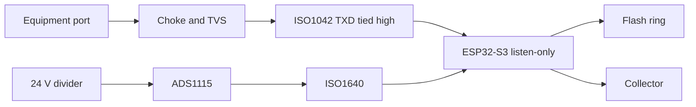

# CAN / MODBUS tap

Listen-only probe for a 24 V accessory port that uses a USB-A shell. An ESP32-S3 records classic CAN frames, a collector stores them, and MODBUS RTU payloads inside those frames are decoded into request/response pairs and a register map.

The probe cannot transmit. The isolated CAN transceiver's TXD pin is tied to its logic supply, so the driver stays recessive, and the ESP32 TWAI controller runs in listen-only mode. Use it on equipment you are allowed to monitor.

## Bring-up before any connection

The USB-A plug is not USB. Do not plug it into a computer, and do not use a normal USB cable between the equipment port and anything else. A 24 V pin in that shell will damage a USB host.

1. With the tap unplugged, meter the equipment port.
2. Identify ground and the pin that sits near 24 V.
3. Scope the other two pins. Classic CAN idle holds both near 2.5 V. RS-485 idle is a differential offset without that 2.5 V pair bias.
4. Wire the tap's USB-A plug to match the measured port: pin 1 = 24 V, pin 2 = CANL, pin 3 = CANH, pin 4 = GND. See [docs/hardware.md](docs/hardware.md).
5. Power the tap from its USB-C port. The 24 V pin is measured and is not the tap's supply.
6. Confirm frames in the collector before trusting a bitrate lock.

If the scope does not show CAN bias, stop. This board's controller only decodes classic CAN. An RS-485 MODBUS RTU pair needs a different transceiver.

## Layout

```text
can-modbus-tap/
  docs/hardware.md     board, pinout, isolation, BOM notes
  docs/protocol.md     capture record, upload JSON, MODBUS pairing
  hardware/bom.csv
  firmware/            ESP-IDF project for ESP32-S3
  collector/           SQLite ingest, decode, and browser UI
```



## Firmware

Requires ESP-IDF 5.3. The Wi-Fi SSID and collector URL are compile-time settings, so they stay out of the git tree.

```bash
cd firmware
idf.py set-target esp32s3
idf.py menuconfig   # CAN MODBUS Tap
idf.py build flash monitor
```

Set the SSID, password, and `TAP_COLLECTOR_URL`. Leave bitrate at 0 to scan 25 kbit/s through 1 Mbit/s. Set a fixed rate once the bus is identified. An empty SSID still records to the on-module flash ring.

The activity LED (GPIO2) stays on while frames arrive. GPIO5 is the TWAI transmit test point and is not routed to the transceiver.

## Collector

```bash
cd collector
go run ./cmd/collector -listen 0.0.0.0:8080 -db data/tap.db
```

Open `http://127.0.0.1:8080/`. Pages:

| Path | Contents |
| --- | --- |
| `/` | Raw CAN frames |
| `/modbus` | CRC-valid MODBUS RTU payloads |
| `/transactions` | Request paired with the next response, 500 ms window |
| `/map` | Register addresses sorted by how often they appear |
| `/v1/frames.csv` | Recent raw frames |

`POST /v1/frames` has no authentication. Run the collector on the lab network. Details are in [docs/protocol.md](docs/protocol.md).

```bash
cd collector && go test ./...
```
